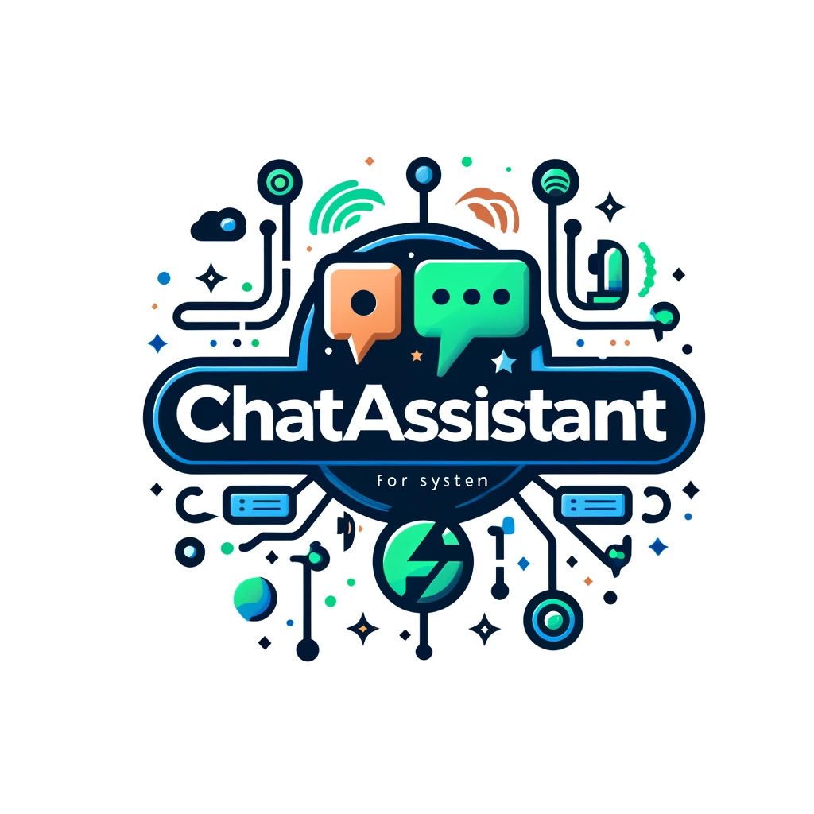
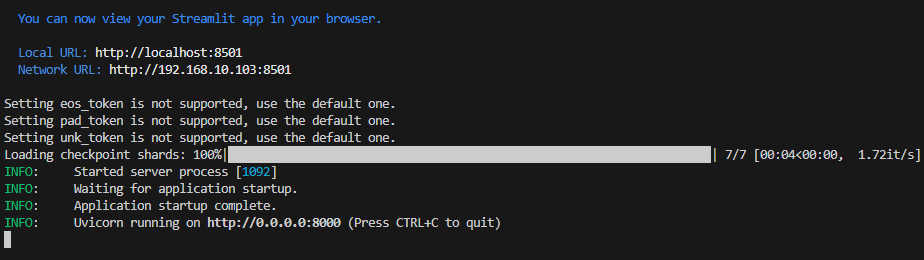
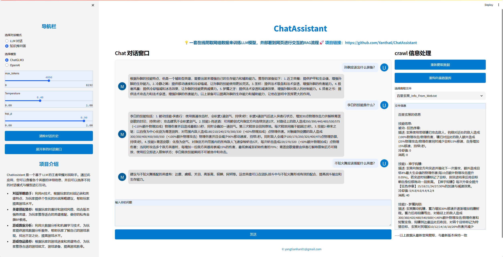
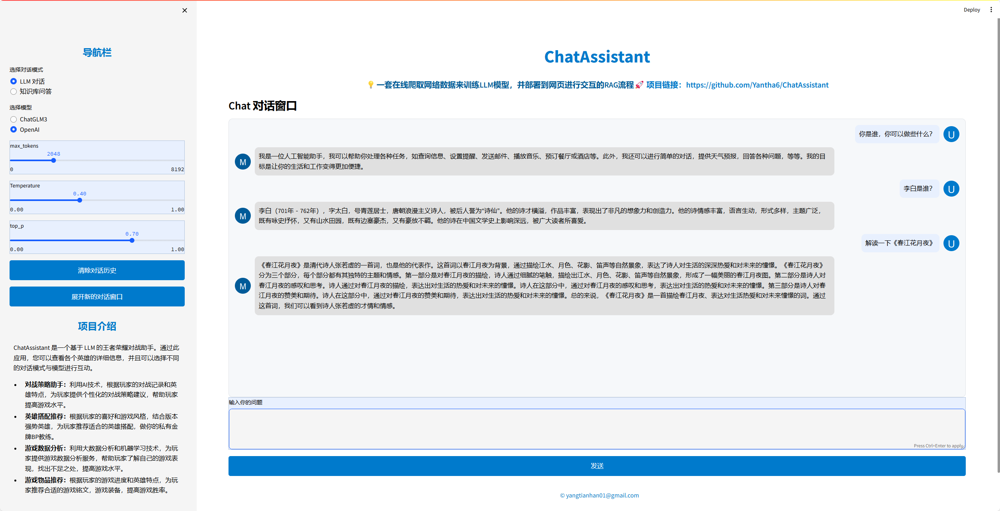
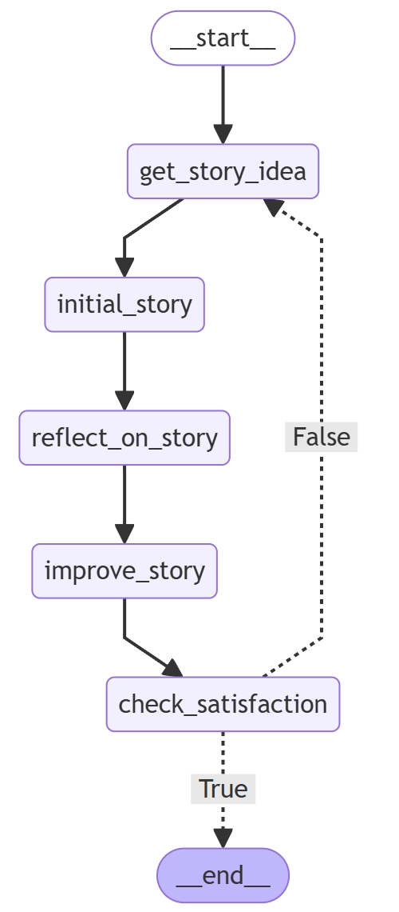

# ChatAssistant

<div style="text-align: center;">
  
</div>
ChatAssistant是一套在线爬取网络数据来训练LLM模型，并部署到网页进行交互的RAG流程

## 项目特点
* 💡 **基于Langchain架构**：支持自由更换LLM模型以及Embedding模型。
* 🎉 **多模型支持**：当前项目支持ChatGLM3本地部署以及OpenAI接口调用。
* 🌍 **多种交互方式**：支持正常LLM对话以及RAG问答两种交互方式。
* 📊 **优化数据处理**：改进Langchain架构中效果较差的DocumentLoader和DocumentSplitter部分，使RAG更加高效和准确。
* 🚀 **支持多轮对话**：支持对话历史，可以与玩家进行多轮交流，提供更加个性化的对话服务。
* 📦 **前后端开发**：前端基于Streamlit，后端基于Fastapi，支持API接口访问。
* 📈 **实时数据源**：数据源基于BeautifulSoup从官网实时爬取，只需更换爬虫部分，即可进行私有垂直领域部署。
* 🌟 **工作流**：支持LangGraph实现工作流，完成英雄的背景故事创作和续写。

## 项目简介
当前爬虫脚本基于王者荣耀官网获取最新版本的英雄、装备、技能等信息，功能如下：
* **对战策略助手**：利用AI技术，根据玩家的对战记录和英雄特点，为玩家提供个性化的对战策略建议，帮助玩家提高游戏水平。
* **英雄搭配推荐**：根据玩家的喜好和游戏风格，结合版本强势英雄，为玩家推荐适合的英雄搭配，做你的私有金牌BP教练。
* **游戏数据分析**：利用大数据分析和机器学习技术，为玩家提供游戏数据分析服务，帮助玩家了解自己的游戏表现，找出不足之处，提高游戏水平。
* **游戏物品推荐**：根据玩家的游戏进度和英雄特点，为玩家推荐合适的游戏铭文、游戏装备，提高游戏胜率。
* **英雄故事创作**：爬取王者荣耀官网英雄背景故事，根据你的故事想法进行故事修改和故事创新。

# 快速开始
1. 默认已经安装python,pytorch以及pip工具，建议使用Anaconda进行版本管理
2. ChatGLM3本地部署硬件配置要求请参考[ChatGLM3](https://github.com/THUDM/ChatGLM3)
3. OpenAI接口调用需要在configs目录下的.env文件中替换自己的KEY

## 环境配置
```bash
pip install -r requirements.txt
```

## 模型下载
完整的模型在HuggingFace，可以用如下的命令下载；如果下载出错，也可以从 ModelScope 中下载。
```bash
git clone https://huggingface.co/THUDM/chatglm3-6b
git clone https://huggingface.co/BAAI/bge-large-zh
```
## 一键启动
```bash
python start.py
```
如果启动成功，你将看到如下命令：


## 项目效果
知识库问答页面：


对话页面：


故事创作工作流：
<div style="text-align: center;">
  
</div>

# 联系我
Author: Tianhan Yang  
QQ: 1257330051  
Email: 1257330051@qq.com  
Email: yangtianhan01@gmail.com